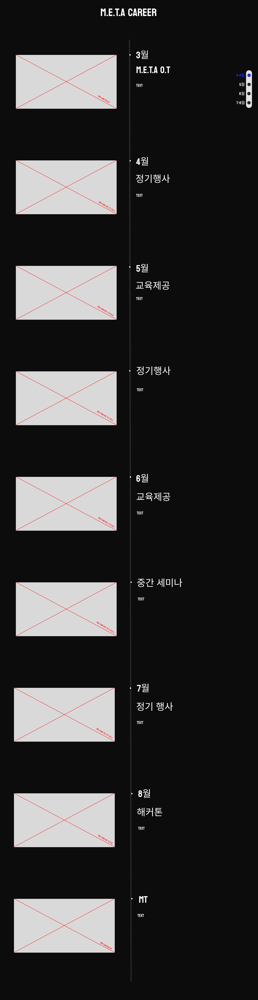

# Meta 프로젝트 팀 1조

- 조장 : 주민재
- 조원 : 김동현, 김민주, 정윤수, 최해인

## 파트 분배
- 디자인 : 김동현, 최해인, 김민주
  - figma를 사용해 커리어 페이지 디자인 (~2024-05-25)
    
- 개발 : 정윤수, 주민재
  - `page-transition.js` : 메인 페이지에서 커리어 페이지 전환 애니메이션 구현 (정윤수, ~2024-05-26)
  - `career.html`, `career.sass` : 커리어 페이지 레이아웃 구현 (주민재, ~2024-05-27)
  - `header.sass` : 페이지 헤더 구현 (주민재, ~2024-05-27)
  - `observer.js` : 페이지 스크롤 애니메이션 구현 + `data.json` 파일 html tag로 변환 (주민재, ~2024-05-28)
  - 추가 기능 구현 : 레이아웃 재배치, 디버깅 (정윤수, 주민재, ~2024-05-29)
  - `data.json` : 커리어 페이지에 적용할 데이터 파일 (주민재, ~2024-05-29)

## 기능
- 페이지 전환 애니메이션
- 페이지 스크롤 애니메이션
- 네비게이션 바 (우측)
- 데이터 추가 삭제 (`data.json`)